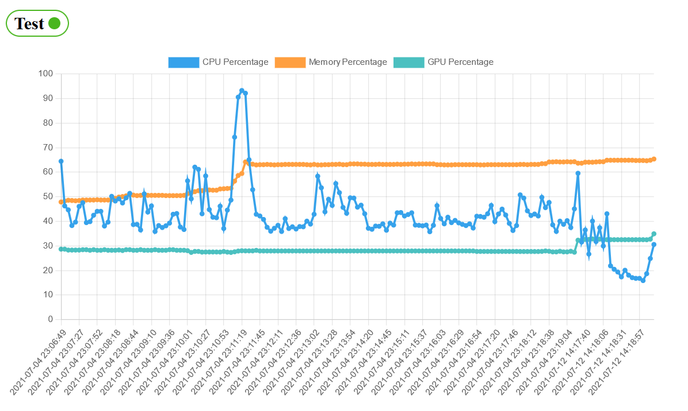

# System Monitor and Overview
 
Started as a tiny script for monitoring multiple servers.  
Currently, cpu usage, gpu and memory amount will be collected and displayed.  
We use it in our lab to monitor the workload of our machine learning servers.

## Server Preview

## Features

There are two modules that work in tandem.  
The first is sysmon_client, which can collect usage statistics and sends them to a running server instance.  
The second in sysmon_server, which is a Flask application that receives the usage data and shows a webpage with graphs.

## Planned features

We want sysmon_client to be able to query for available machines and run our (python) tasks remotely, without having to set up and distribute files manually to each server.  
Next to this big goal there are a few enhancements for the style and information shown at the webpage planned.  
Some documentation. Mainly about the client, since you can and will need to import it and tell it what to do.

## Distribution

The plan is to have both, client and server, available via `pip install`.  
While currently not maintained since we are changing a lot in ths early stages, you can later clone and build docker images of sysmon. Please not that for gpu statistics in Docker the gpu must be accessible by Docker and the running container.